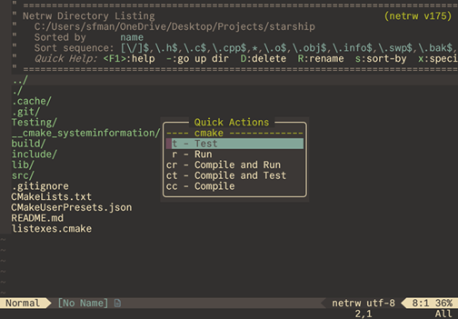
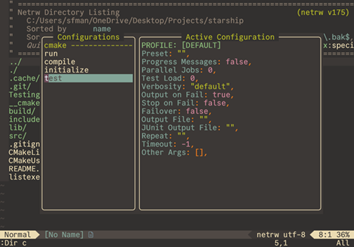

Neovim is a terminal-based and highly configurable code editor that lacks the features of a standard IDE. My project Director is my attempt at enabling Neovim to function as a stand-alone development environment. Director comes with little functionality of its own, but provides a framework for creating workflows and actions using lua. Workflows are configurable at runtime and can be saved to disk (when enabled) to use later. For instance, I created a Director workflow CMake, that allows users to specify which flags to pass to the build command. I also created a workflow for TypeScript that automatically runs `tsc --watch` whenever a TypeScript project is detected.

As of right now, I am the only developer of Director. I hope that the project will gain more popularity in the future, so more developers can propose and contribute new features. A sizeable chunk of the project involved writing documentation because the plugin must be understood to use properly. I put many hours of effort into writing both the source code and guides with the goal of expanding Neovim's functionality as an IDE.

The project was an adventure in terminal UI and UX design that required me to think critically about making the plugin smooth as possible to use and easy to configure. I also learned how to write engaging and informative API documentation in the process.

The source code can be found [here](https://github.com/SamManibog/director) along with documentation and installation instructions for Lazy, one of Neovim's package managers.
