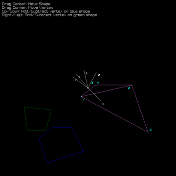
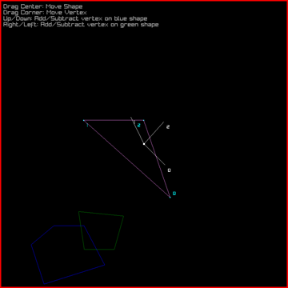

The Gilbert-Johnson-Keerthi Distance Algorithm allows us to find the distance between two convex sets. However, this algorithm is most commonly used to detect if two shapes are colliding. The intuition behind this relies on something called a Minowski difference which is the shape created by subtracting every point within one shape from every point within the other. This new shape has a special property where if it contains the origin, (0, 0), then the two original shapes intersect. The GJK Algorithm attempts to locate the origin within a Minowski difference, and if it fails, then the two shapes are deemed not to be colliding.

I was the sole creator of the project. The process involved background research on the algorithm and the graphics library I used. I implemented the algorithm myself, and came up with new equations to allow the GJK Algorithm to work in 2D. The algorithm was originally designed for a 3D context and uses operations that are only available in 3 dimensions, so new equations were required for a 2D implementation.

This project is a demonstration of the importance of the mathematical background required for applied computer science. When making it, I learned how to create functions based in math in order to efficiently detect collisions. This demonstration is written in Rust and uses the Raylib library for rendering.

Source code may be found [here](https://github.com/SamManibog/GjkShowcase), and can be compiled after installing [Cargo](https://doc.rust-lang.org/cargo/getting-started/installation.html), then running `cargo run` in the source directory.
