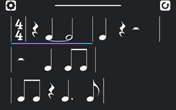
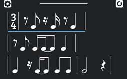
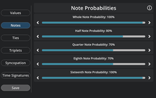

Rhythm Trainer uses an algorithm to generate unlimitted, customizable rhythms that users may "play" by drumming it on their phone screen. The app will then give feedback on when the user played each beat, so they can reflect on which kinds of rhythm they need to practice more. The user can choose from several difficulty presets to customize the rhythms that show up on their screen. If the user chooses, they can take a deep-dive into the settings for each preset and can configure anything from time signatures that appear to the frequency of each note.

Rhythm Trainer was my first major programming project, and I was its sole designer. I made everything from the underlying algorithms, to the icons and UI, and even to the art for each note. Looking back now, the code seems rudimentary and could absolutely use a "quick" clean-up, but if anything it serves as a reminder for how far I've come as a software engineer.

You can find the source code along with prebuilt binaries for Windows and Android at the [project page](https://github.com/SamManibog/RhythmTrainer).
